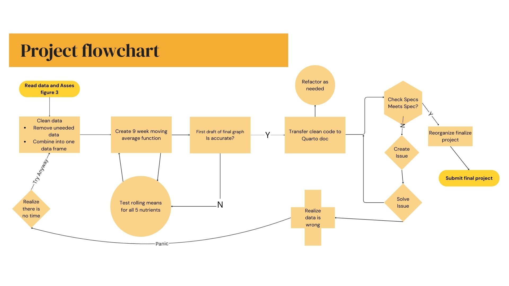

# Lucian Scher EDS214 Final Project -

This repository contains the code and analysis for Lucians final project in EDS 214. This project reproduces figure 3 of this paper:

```         
     Schaefer DouglasA, McDowell WH, Scatena FN, Asbury CE. Effects of hurricane disturbance on stream water concentrations and fluxes in eight tropical forest watersheds of the Luquillo Experimental Forest, Puerto Rico. Journal of Tropical Ecology. 2000;16(2):189-207. 
```

<doi:10.1017/S0266467400001358>

Github Pages link: <https://lucianbluescher.github.io/EDS214-Final/>



## How this works

This analysis works by organizing the data used in fig 3 from the Schaefer data set by nutrient, date, site and concentration. Then it finds the rolling mean using a 9 week window for all available data. Lastly the analysis plots the data to recreate fig 3. 


To follow the analysis please run: 
0_init_envi.R which will install and load packages 
1_data_cleaning.R which will clean and add data to your environment paper.md


## Contents


1.  data:

-   raw untouched data (raw_data)
-   intermediate data (rollmean_all.csv)

2.  docs:

-   Script for Github pages (index.html)

3.  figs:

-   Output of final figure for easy access (fig_3copy)

4.  outputs

-   Cleaned data for figure (fig3data.csv)
-   Rolling means for all nutrients (rollmean_all.csv)

5.  paper:

-   Analysis script (paper.qmd) 6.R:
-   Environment Initialization (init_envir.r)
-   Rolling Mean function (rolling_mean.R)

7.  scratch:

-   Spageti code (spageti.R)
-   self assessments (peer-assessment.md)
-   peer assessment (self-assessment.md)
